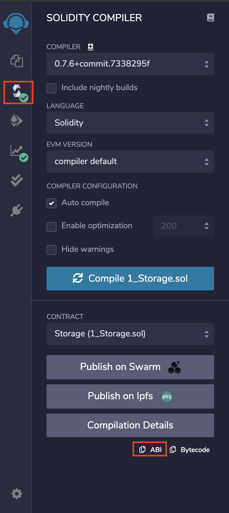

## Exemple - Simple Storage 
### Smart contract à utiliser 
```js
// SPDX-License-Identifier: GPL-3.0
    pragma solidity >=0.7.0 <0.8.0;
    
    /**
    * @title Storage 
    * @dev Store & retrieve value in a variable
    * */
    contract Storage {

	    uint256 number;

	    /**
	     * @dev Store value in variable
	     * @param num value to store
	     */
	    function store(uint256 num) public {
	        number = num;
	    }

	    /**
	     * @dev Return value 
	     * @return value of 'number'
	     */
	    function retrieve() public view returns (uint256){
	        return number;
	    }
    }
```

### Création du projet et installation des dépendances

Pour interagir avec la blockchain Ethereum à partir de JavaScript, nous aurons besoin de la librairie web3. 

 **1. Création d'un nouveau projet**
 **2. Création d'un fichier *server.js***
```js
var  express  =  require('express');
var  app  =  express();

app.use(express.static(__dirname  +  '/public')); 

var  port  =  8000; // you can use any port

app.listen(port);
console.log('server on'  +  port);
```
 **3. Création d'un dossier public qui va contenir notre fichier html par la suite** 
```console
 $ mkdir public 
 ```

 **4. Création d'un nouveau fichier *index.html* (sous le dossier public) qui contiendra le code suivant :** 

```html
<!DOCTYPE html>

<html>
<head>

<meta charset='utf-8'>
<meta http-equiv='X-UA-Compatible' content='IE=edge'>

<title>Storage Dapp</title>

<meta name='viewport' content='width=device-width, initial-scale=1'>

<script type="text/javascript" src="https://unpkg.com/web3@1.3.1/dist/web3.min.js"></script>
<script src="https://unpkg.com/@metamask/detect-provider/dist/detect-provider.min.js"></script>

</head>

<body>
Storage Dapp
<br  >
<button onclick="getNumber();">Print Number</button>
<button onclick="setNumber();">Set Number</button>
<br  /><br  />

Status: <span id="status">Loading...</span>

<script type="text/javascript"></script>

</body>
</html>
```
 **5. Charger Web3**
Maintenant que notre structure de base et nos dépendances sont là, nous pouvons ajouter le code qui connecte notre application à la blockchain.
Nous ajouterons le code suivant à l'intérieur de la balise de script dans le corps de l'application (dans le fichier *index.html*) :

```js
async  function  loadWeb3() {
	const  provider  =  await  detectEthereumProvider();
	if (provider) {
		// handle provider
		window.web3  =  new  Web3(provider);
	} else {
		// handle no provider
		console.log("no provider");
	}
}

async function load() {
    await loadWeb3();
    updateStatus('Ready!');
}

function updateStatus(status) {
    const statusEl = document.getElementById('status');
    statusEl.innerHTML = status;
    console.log(status);
}

load();
```
Tout le code ci-dessus est assez simple, à l'exception de la fonction loadWeb3, que nous allons expliquer plus en détail dans ce qui suit. Cette fonction est chargée d'établir la connexion et de nous autoriser à interagir avec la blockchain.

Pour interagir avec notre smart contract, nous aurons besoin d'une nouvelle instance de Web3. Lors de la création de cette instance, nous devons préciser le fournisseur que nous voulons utiliser (Infura ...). Comme nous utilisons MetaMask, nous utilisons le fournisseur window.ethereum injecté par l'extension MetaMask.

**Attention**
Assurez-vous d'accepter et de connecter MetaMask à votre application pour continuer.

 **6. Récupération d'une instance de notre smart contract**

Jusqu'à présent, votre code a accès à la blockchain Ethereum ; assurons-nous maintenant que votre application peut interagir avec le smart contract.

Pour cela, nous allons créer une nouvelle fonction permettant de créer une instance du smart contract correspondant.

```js
async function loadContract() {
    return await new window.web3.eth.Contract(ABI, contractAddress);
}
```
Pour obtenir une instance de smart contract déployée sur la blockchain, il suffit de récupérer deux informations :

 - Spécifier l'ABI du smart contract 
 - Spécifier l'address à laquelle le smart contract a été déployé 
 
***Vous pouvez les extraire de Remix***
> Pour obtenir l'ABI de votre smart contract, allez dans Remix sous l'onglet **Compiler**, assurez-vous de bien compiler, puis cliquez sur `ABI`.


Voici à quoi ressemble le code de fonction complet pour la récupération de mon smart contract :
```js
async function loadContract() {
    return await new window.web3.eth.Contract([
		{
			"inputs": [
				{
					"internalType": "uint256",
					"name": "num",
					"type": "uint256"
				}
			],
			"name": "store",
			"outputs": [],
			"stateMutability": "nonpayable",
			"type": "function"
		},
		{
			"inputs": [],
			"name": "retrieve",
			"outputs": [
				{
					"internalType": "uint256",
					"name": "",
					"type": "uint256"
				}
			],
			"stateMutability": "view",
			"type": "function"
		}
    ], '0xd9145CCE52D386f254917e481eB44e9943F39138');
}
```
Une fois cela fait, nous pouvons simplement appeler loadContract depuis notre fonction de chargement :
```js
async function load() {
    await loadWeb3();
    window.contract = await loadContract();
    updateStatus('Ready!');
}
```
 **8. Lecture des données du smart contract**
Nous sommes prêts à appeler les fonctions du smart contract, et nous commencerons par récupérer notre *number* du smart contract.

Nous pouvons récupérer les données du smart contract très rapidement grâce au web3 ; voici un exemple pour obtenir la valeur de la variable *number* :

```js
async function getNumber() {
    updateStatus('fetching Cool Number...');
    const number = await window.contract.methods.retrieve().call();
    updateStatus(`Number: ${number}`);
}
```
**Super facile !** 
Nous utilisons l'instance du `contrat` de la section précédente, nous obtenons les méthodes et appelons la fonction **retrieve**, et enfin, nous utilisons `call` pour lancer la requête à distance.

 **9. Modifier des valeurs du smart contract**
Enfin, nous devons nous assurer que nous pouvons également effectuer des transactions d'écriture avec le smart contract, et pour cela, nous montrerons un exemple en accédant à notre fonction **store** pour changer la valeur de la variable *number* stocké dans le smart contract.

Notre fonction de changement attribuera simplement un nouveau numéro aléatoire et l'enregistrera dans la blockchain :

```js
async function setNumber() {
    const value = Math.floor(Math.random() * 100);
    updateStatus(`Updating number with ${value}`);
    const account = await getCurrentAccount();
    const number = await window.contract.methods.store(value).send({ from: account });
    updateStatus('Updated.');
}
```

> Il y a deux choses à souligner ici :
> 1. Nous faisons référence à une fonction `getCurrentAccount()`, qui n'est pas définie pour l'instant ; nous l'ajouterons un peu plus tard.
> 2. Nous appelons notre setter. Si vous faites attention à
> la ligne où nous appelons la méthode `store` du contrat, elle
> semble légèrement différente de ce que nous avons fait pour
> l'appel avec `getNumber`.
> 
> ```js
> const number = await window.contract.methods.store(value).send({
> from: account });
> ```
> Au lieu d'utiliser `call`, nous utilisons la méthode `send`. Nous
> devons préciser le compte de l'expéditeur. 
> **Pourquoi ?** 
> Il s'avère que nous avons besoin d'une transaction pour modifier les valeurs dans la blockchain. Cela dit, une transaction nécessite un compte `from` et
> `to` pour être valide, `from` qui est celui qui lance la transaction et `to` vers qui est dirigé la transaction, dans notre cas, l'adresse `to` est notre smart contract.
**Pouvons-nous utiliser n'importe quel compte à partir de la valeur ?**
> Non, il doit s'agir d'un compte auquel vous avez accès (et dans notre
> cas, enregistré sur votre portefeuille MetaMask) car vous devrez
> autoriser la transaction et confirmer les frais de gas.

Maintenant que nous avons réglé ce point, construisons la méthode `getCurrentAccount()` :
```js
async function getCurrentAccount() {
    const accounts = await window.web3.eth.getAccounts();
    return accounts[0];
}
```
**Web3 est excellent !** 
Nous pouvons interagir avec la blockchain et notre portefeuille MetaMask. Il est donc possible, via le Web3, de demander des informations sur les comptes enregistrés sur le portefeuille. Dans notre exemple, nous les obtenons tous et utilisons le premier compte pour effectuer les transactions.

### Exécution du code 

```console
$ node server.js
```

### Lien Github 

 